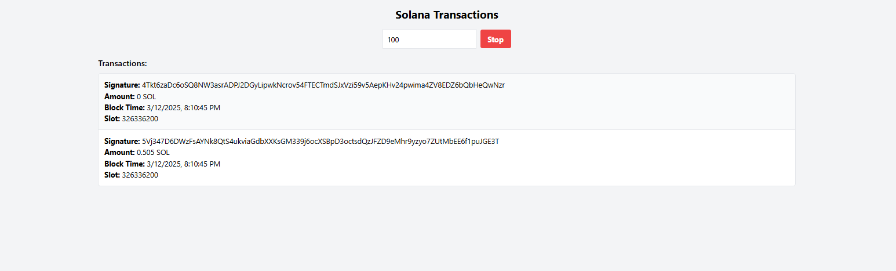

# Solana Transactions

This application watches the Solana blockchain for transactions exceeding a specified threshold (in SOL) and displays them in real-time using WebSockets. It's built with React, Tailwind CSS, Node.js, `ws`, and `@solana/web3.js`.



## Features

- Real-time display of Solana transactions exceeding a user-defined threshold.
- Configurable threshold (in SOL).
- Start/Stop functionality to control transaction monitoring.
- Connection status indicator (green/red circle) with hover text.
- Displays transaction signature, SOL amount, block time, and slot.
- Uses Tailwind CSS for styling.

## Prerequisites

- **WebContainer Environment:** This application is specifically designed to run within a WebContainer environment. You _cannot_ run it directly on your local machine without significant modifications.
- **Node.js and npm:** WebContainer provides these.
- **Solana RPC Endpoint:** The application uses a public Solana RPC endpoint (`https://api.mainnet-beta.solana.com`) by default. You can modify this in the `.env` file if you have a different endpoint. _No Solana wallet is required for this application_, as it only _reads_ public blockchain data.

## Installation (within WebContainer)

1.  **Create Project Files:** Create the necessary project files and directories. The easiest way is to use the provided code artifact within the WebContainer environment. This will create the following structure:

    ```
    solana-transaction-watcher/
    ├── .env
    ├── index.html
    ├── package.json
    ├── postcss.config.cjs
    ├── server.js
    ├── src/
    │ ├── App.jsx
    │ ├── index.css
    │ └── main.jsx
    ├── tailwind.config.js
    └── vite.config.js
    ```

2.  **Install Dependencies:** Run the following command in the WebContainer terminal:

    ```bash
    npm install
    ```

    This will install the required Node.js packages (listed in `package.json`), including:

    - `@solana/web3.js`: For interacting with the Solana blockchain.
    - `ws`: For WebSocket communication.
    - `dotenv`: For loading environment variables (RPC URL).
    - `vite`: For the frontend development server and build process.
    - `react`, `react-dom`: For the frontend UI.
    - `tailwindcss`, `postcss`, `autoprefixer`: For styling.
    - `concurrently`: For running the frontend and backend servers simultaneously.

3.  **Configure RPC Endpoint (Optional):** If you want to use a different Solana RPC endpoint, modify the `SOLANA_RPC_URL` variable in the `.env` file.

## Usage

1.  **Start the Development Server:** Run the following command in the WebContainer terminal:

    ```bash
    npm run dev
    ```

    This will start both the Vite development server (for the frontend) and the Node.js server (for the backend).

2.  **Set the Threshold:** In the application's UI, enter the desired threshold (in SOL) in the input field. This determines the minimum transaction size to be displayed. The default is 100 SOL.

3.  **Start/Stop Monitoring:**

    - Click the "Start" button to begin monitoring transactions.
    - Click the "Stop" button to stop monitoring.

4.  **View Transactions:** Transactions exceeding the threshold will appear in the list, with the most recent transactions at the top. Each transaction displays:

    - Signature
    - SOL Amount
    - Block Time (in your local timezone)
    - Slot

5.  **Connection Status:** The green/red circle in the bottom-right corner indicates the WebSocket connection status. Hover over the circle to see a tooltip ("Connected" or "Disconnected").

## Troubleshooting

- **"Connection closed abnormally without receiving a close frame" Error:** This error indicates an unexpected WebSocket disconnection. It can be caused by network issues, server errors, or client-side problems. Check the WebContainer terminal for more detailed error messages from the Node.js server. The server logs include extensive debugging information to help pinpoint the cause.
- **No Transactions Displayed:**
  - Ensure the server is running and the WebSocket connection is established (green indicator).
  - Make sure the threshold is set appropriately. If it's too high, you might not see any transactions. Try lowering it temporarily to 0.1 SOL for testing.
  - Confirm that there are actually transactions exceeding the threshold on the Solana mainnet-beta network. You can use a Solana explorer (like [https://explorer.solana.com/](https://explorer.solana.com/)) to verify.
- **Application Stuck/Not Loading:** If you encounter issues with the application not loading or displaying correctly, check the browser's developer console (usually F12) for JavaScript errors.

## Technologies Used

- **Frontend:**
  - React
  - Tailwind CSS
  - Vite
  - `ws` (WebSocket client)
- **Backend:**
  - Node.js
  - `ws` (WebSocket server)
  - `@solana/web3.js`
  - `dotenv`

This README provides a comprehensive guide to setting up and using the Solana Transactions application within the WebContainer environment. Remember to consult the browser's developer console and the WebContainer terminal for debugging information.
